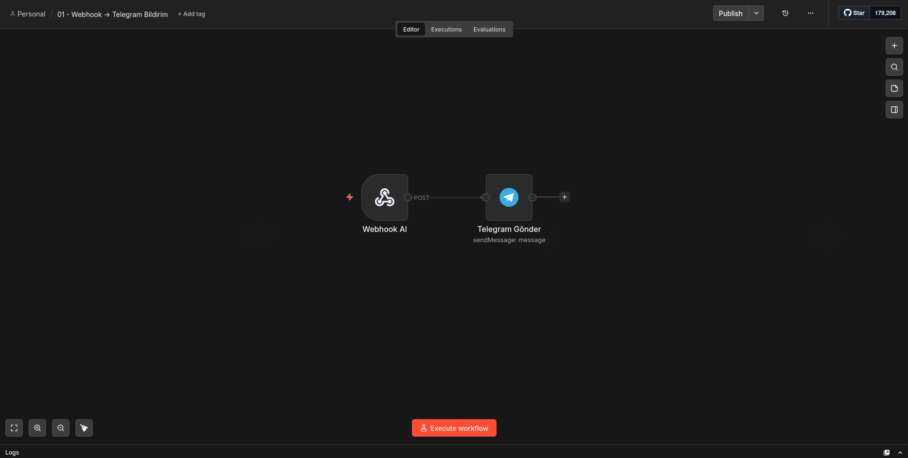
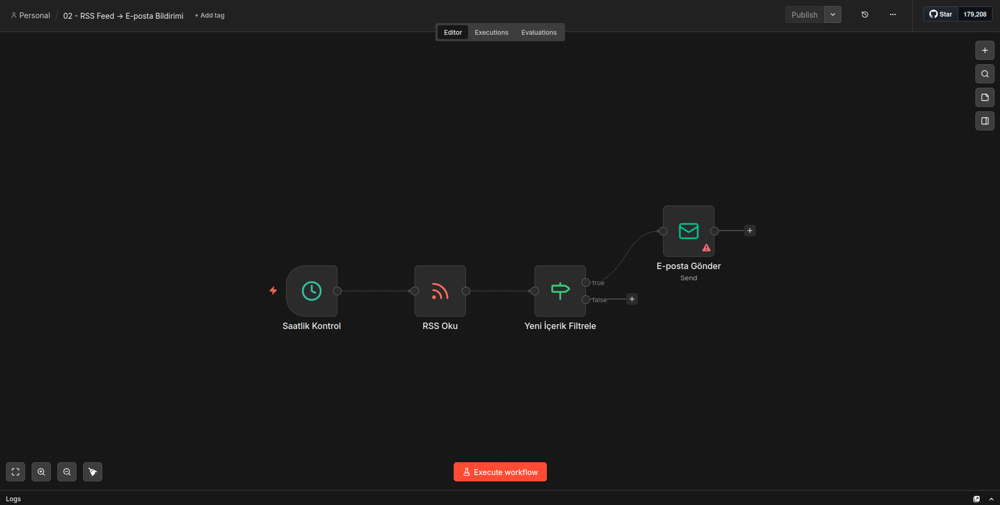
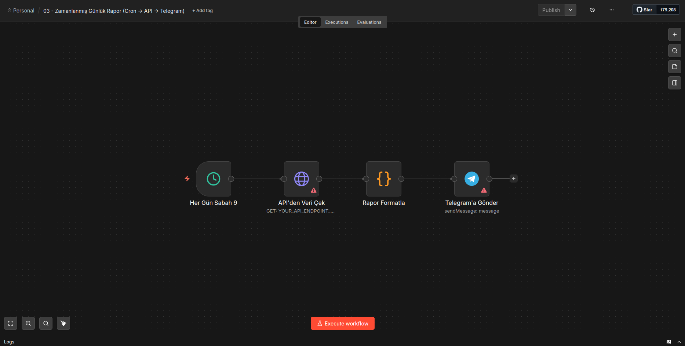
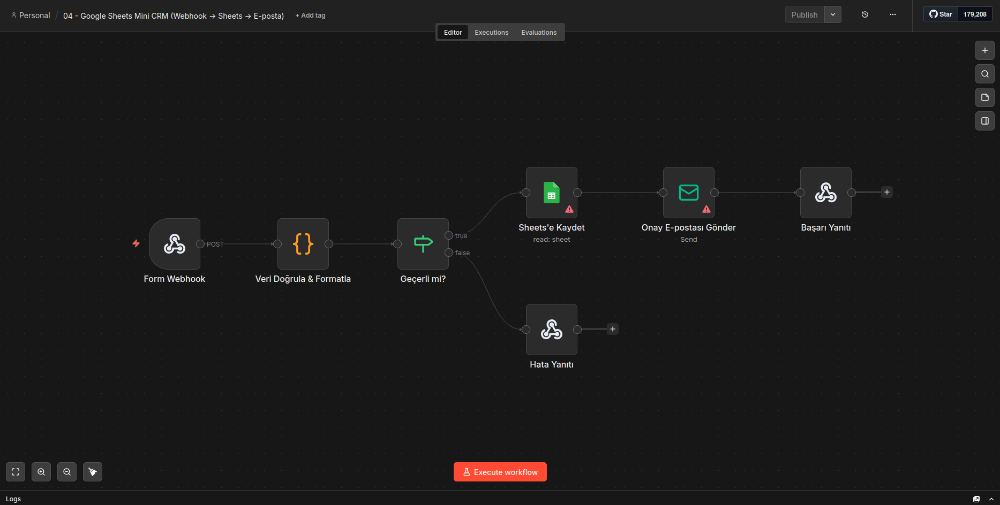
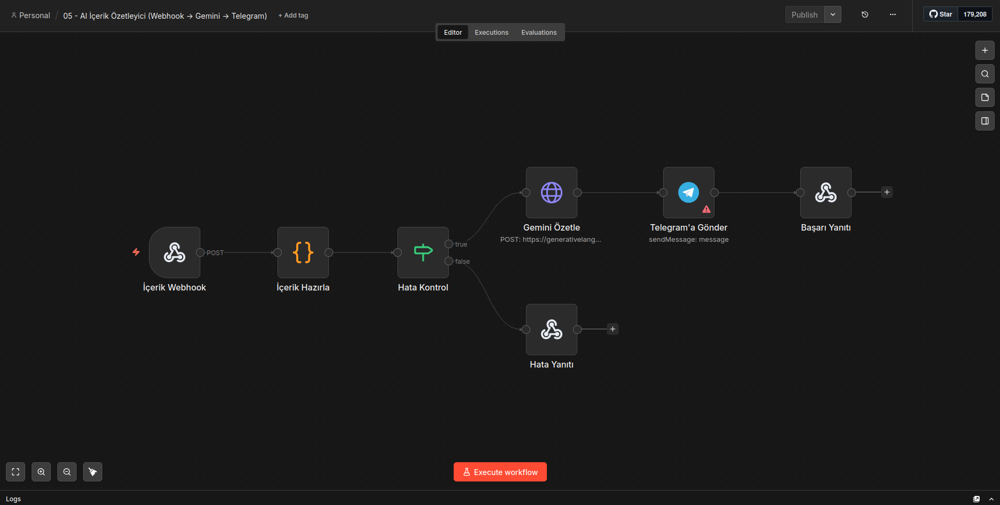
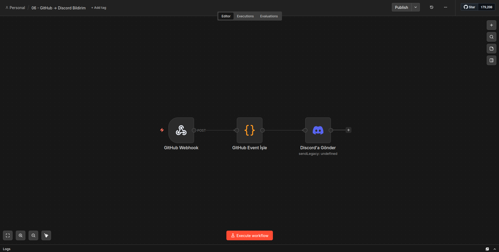
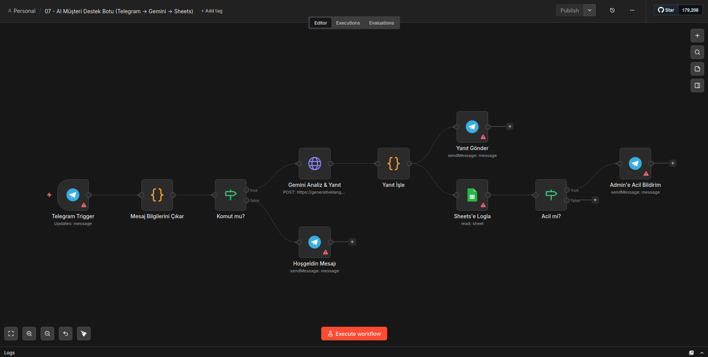
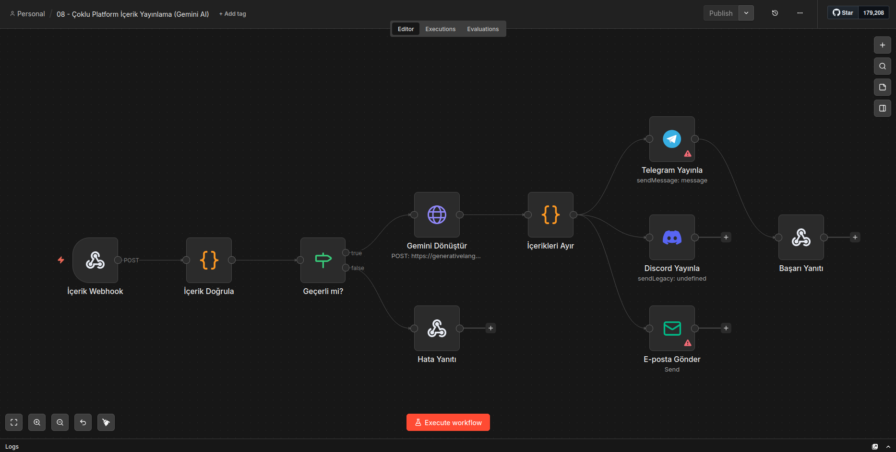
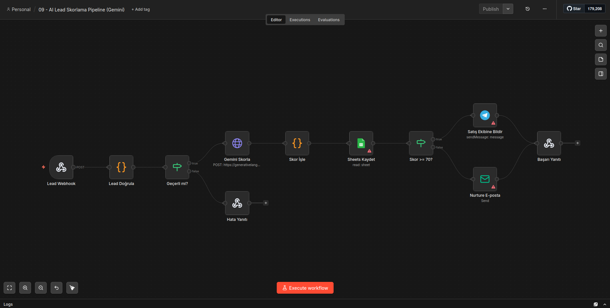
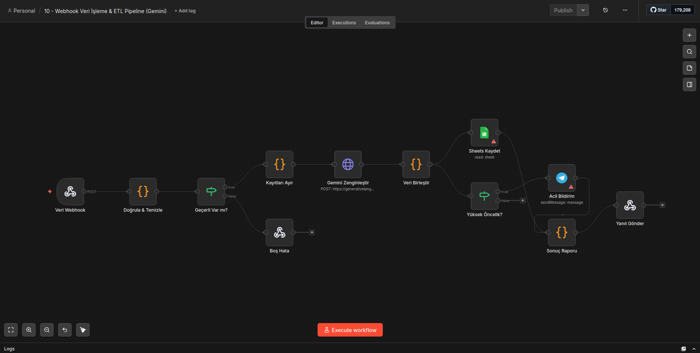

# N8N Otomasyon Şablonları Koleksiyonu

Bu depo, günlük iş akışlarınızı hızlandırmak ve otomatize etmek için hazırlanmış **10 adet kullanıma hazır (Plug & Play) n8n otomasyon şablonunu** içermektedir. Şablonlar kolaydan zora doğru sıralanmıştır.

Tüm yapay zeka (AI) destekli şablonlar, maliyetleri sıfıra indirmek ve test süreçlerini kolaylaştırmak amacıyla **Google Gemini 2.5 Flash** modelini ücretsiz API hakları ile kullanacak şekilde yapılandırılmıştır. OpenAI kredisine ihtiyacınız yoktur.

## 🚀 Genel Gereksinimler

Şablonları kullanmaya başlamadan önce aşağıdaki platformlardan ilgili olanlar için hesap API/Webhook bilgilerini hazırlamanız yeterlidir:

- **Google AI Studio** : Ücretsiz Gemini API Anahtarı (Tüm AI şablonları için zorunlu)
- **Telegram** : Bot Token (`@BotFather` üzerinden) ve Chat ID
- **Google Sheets** : N8N Credentials üzerinden yetkilendirilmiş Google hesabı
- **Discord** : Kanal Webhook URL'si
- **E-posta (SMTP)** : Gmail, Yandex vb. SMTP gönderim bilgileri

---

## 📦 Şablonlar

Aşağıda her bir şablonun ne işe yaradığı, senaryosu ve kullanım amacı detaylandırılmıştır. Şablonu kullanmak için ilgili `.json` dosyasını n8n arayüzündeki mevcut workflow ekranına sürükleyip bırakabilir veya `Import from File` seçeneğini kullanabilirsiniz.

---

### 🟢 Kolay Seviye

#### 1. Webhook → Telegram Bildirim

`01-telegram-mesaj-bildirim.json`

**Nasıl Kullanılır:**
1. **Webhook Node**: Webhook URL'sini kopyalayıp bildirim gönderecek olan sisteme (form, sunucu vb.) ekleyin.
2. **Telegram Node**: Credentials kısmından (veya doğrudan içine) Telegram Bot API token'ınızı seçin ve `chatId` kısmına `YOUR_TELEGRAM_CHAT_ID_HERE` yazan yere kendi Telegram Chat ID'nizi yapıştırın.

Herhangi bir uygulamadan, web sitesindeki bir iletişim formundan veya sunucunuzdan gelen anlık `POST` isteklerini (Webhook) yakalayarak doğrudan Telegram hesabınıza bildirim olarak düşmesini sağlar. 

**Kullanım Alanı:** Sistem uyarıları, iletişim formu doldurma bildirimleri, basit alarm sistemleri.

#### 2. RSS Feed → E-posta Bildirimi

`02-rss-email-bildirim.json`

**Nasıl Kullanılır:**
1. **RSS Oku Node**: `URL` kısmına (`YOUR_RSS_FEED_URL_HERE`) takip etmek istediğiniz RSS linkini yapıştırın.
2. **E-posta Gönder Node**: SMTP Credentials bağlantınızı yapın, gönderici mailini ve `toEmail` kısmına (alıcı olan) e-posta adresinizi girin. Cron trigger süresini isteğe bağlı güncelleyebilirsiniz.

Belirttiğiniz bir RSS kaynağını her saat başı kontrol eder. Eğer son 1 saat içerisinde yeni bir içerik yayınlanmışsa, içeriğin başlığını, kısa bir özetini ve linkini şık bir HTML şablonu ile belirlediğiniz e-posta adresine gönderir.

**Kullanım Alanı:** Rakip basın bülteni takibi, favori blogların takibi, kripto / haber bülteni otomasyonu.

#### 3. Zamanlanmış Günlük Rapor (Cron → API → Telegram)

`03-zamanlayici-gunluk-rapor.json`

**Nasıl Kullanılır:**
1. **API'den Veri Çek Node**: `URL` alanına veri çekeceğiniz endpoint'in adresini girin ve gerekiyorsa Header/Auth bilgilerinizi ekleyin. Rapor Formatla nodunda kod yapısını dönen verilere göre ufakça düzenleyebilirsiniz.
2. **Telegram'a Gönder Node**: `chatId` alanına kendi sohbet kimliğinizi ve Credentials alanına bot token'ınızı tanımlayın.

Her gün sabah saat tam 09:00'da çalışacak şekilde ayarlanmıştır. Belirttiğiniz bir API uç noktasına (endpoint) istek gönderir, dönen JSON verisini (örneğin günlük satışlar, kayıt olan kullanıcı sayısı vb.) okur ve okunabilir bir formata dönüştürüp Telegram'a günlük rapor olarak iletir.

**Kullanım Alanı:** E-ticaret günlük satış özeti, SaaS platformları günlük yeni üye özeti.

---

### 🟡 Orta Seviye

#### 4. Google Sheets Mini CRM

`04-google-sheets-crm.json`

**Nasıl Kullanılır:**
1. **Form Webhook**: Test url'nizi kopyalayıp web formunuzun hedef kısmına yapıştırın. Gelen ad, email gibi değerler Node içinde otomatik doğrulanacaktır.
2. **Sheets'e Kaydet Node**: Credentials üzerinden Google Sheet hesabınızı bağlayın. `Document ID` kısmına e-tablo kimliğinizi yapıştırın.
3. **Onay E-postası Gönder Node**: SMTP bilgilerinizi tanımlayın ve `fromEmail` alanına kendi iş/destek mailinizi yazın.

Dışarıdan bir webhook aracılığıyla (örneğin Typeform veya kendi web sitenizin formu) gelen müşteri bilgilerini alır. Veriyi doğrular (isim veya mail eksikse hata döner), geçerli verileri doğrudan Google Sheets üzerindeki "Müşteriler" tablosuna yeni bir satır olarak yazar ve müşteriye otomatik bir "Talebiniz Alındı" e-postası gönderir.

**Kullanım Alanı:** Basit müşteri takip sistemi, etkinlik kayıt formu yönetimi, iletişim süreçlerinin otomasyonu.

#### 5. AI İçerik Özetleyici (Gemini)

`05-ai-icerik-ozetleyici.json`

**Nasıl Kullanılır:**
1. **İçerik Webhook**: Özetlenecek uzun PDF, metin veya makaleleri webhook ile POST edin. 
2. **Gemini Özetle (HTTP Request) Node**: URL kısmında bulunan linkin sonundaki `YOUR_GEMINI_API_KEY_HERE` yazısını silin ve kendi ücretsiz Gemini API Anahtarınızı yapıştırın.
3. **Telegram'a Gönder Node**: Kendi Telegram adresinize özetin gelmesi için Chat ID'nizi değiştirin.

Uzun metinleri saniyeler içinde özetleyen bir otomasyon. Webhook üzerinden metin, dil ve istenen özet uzunluğu (kısa, orta, uzun) parametrelerini alır. **Google Gemini** API'sine bağlanarak içeriği istenen formatta analiz eder ve profesyonel bir özet çıkarıp Telegram'a gönderir.

**Kullanım Alanı:** Uzun araştırma raporlarını hızlıca tüketme, haber özetleme, meeting notlarından karar özeti çıkarma.

#### 6. GitHub → Discord Bildirim

`06-github-discord-bildirim.json`

**Nasıl Kullanılır:**
1. **GitHub Webhook Node**: N8N'in sağladığı Webhook test URL'sini (Production URL) kopyalayın, Github deponuzdaki `Settings -> Webhooks` bölümüne yapıştırın (Event olarak "Send me everything" seçebilirsiniz).
2. **Discord'a Gönder Node**: Discord sunucunuzun herhangi bir kanalından oluşturduğunuz Webhook URL'sini credentials veya ayar kısmından bu node'a dahil edin.

GitHub deponuzda meydana gelen olayları takip eder. Birisi kod pushladığında (ve commit mesajlarını), yeni bir Pull Request açtığında, kapattığında veya yeni bir Issue açtığında bu olayları yakalar. Ayrılmış bir Discord kanalına, eylemin türüne göre özel renk kodlarına ve ikonlara sahip embed (zengin) mesajlar gönderir.

**Kullanım Alanı:** Yazılım ekipleri için anlık kod değişiklik takibi, repo izleme ağı.

---

### 🔴 Zor Seviye

#### 7. AI Müşteri Destek Botu (Telegram → Gemini → Sheets)

`07-ai-musteri-destek-botu.json`

**Nasıl Kullanılır:**
1. **Telegram Trigger Node**: Müşterinin size yazacağı Telegram botunun token'ını tanımlayın ve webhook bağlantısını aktive edin.
2. **Gemini Analiz & Yanıt Node**: HTTP Request URL'si sonundaki anahtarı kendi Gemini API key'inizle değiştirin.
3. **Sheets'e Logla Node**: Log takibi yapacağınız Google E-tablonun ID'sini girin. 
4. **Admin'e Acil Bildirim Node**: "Acil" kategorisindeki durumlar için kendinizin veya nöbetçi sistem yöneticinizin Chat ID'sini girin.

Doğrudan Telegram Botu üzerinden müşteriyle etkileşime giren akıllı bir asistan. 
- Müşterinin yazdığı mesajı **Gemini AI** alır.
- Mesajın kategorisini (Teknik, Fatura, Şikayet vb.) ve aciliyet derecesini (Düşük, Orta, Yüksek) belirler.
- Müşteriye nazikçe çözüm üreten veya yönlendiren bir cevap yazar.
- Tüm bu etkileşimi (orijinal mesaj, yapay zeka cevabı, analiz sonucu) bir Google Sheets dosyasına loglar.
- Eğer konu "Acil" (Yüksek öncelik) olarak etiketlendiyse, doğrudan sistem yöneticisine ayrı bir Telegram bildirimi gönderir.

**Kullanım Alanı:** 7/24 ilk seviye (L1) müşteri destek otomasyonu, destek biletleri triyaj (önceliklendirme) sistemi.

#### 8. Çoklu Platform İçerik Yayınlama (AI Dönüşüm)

`08-coklu-platform-icerik-yayinlama.json`

**Nasıl Kullanılır:**
1. **İçerik Webhook**: İçerik metinlerini (başlık, içerik, yazar) JSON olarak buraya gönderin.
2. **Gemini Dönüştür Node**: API Key'inizi URL kısmına yapıştırın.
3. **Yayınlama Node'ları (Telegram, Discord, E-posta)**: Sırasıyla Telegram Kanalı ID'nizi, Discord Webhook URL'nizi ve SMTP bülten alıcı adreslerinizi ilgili alanlardaki `YOUR_..._HERE` yazılarıyla değiştirin.

İçerik üreticilerinin işini tek bir tıklamaya indirgeyen kapsamlı bir yayın akışı. Sistem bir blog yazısının ham metnini (webhook üzerinden) alır.
- **Gemini AI**, bu uzun yazıyı okur ve her platformun dinamiğine uygun 3 farklı versiyon üretir: Telegram için emojili kısa mesaj, Discord için detaylı düz metin, E-posta bülteni için vurucu bir konu başlığı ve HTML e-posta gövdesi.
- Ardından bu üç farklı içerik formatını eş zamanlı olarak Telegram, Discord ve E-posta (SMTP) üzerinden abonelere iletir.

**Kullanım Alanı:** Pazarlama departmanları, içerik üreticileri, blog sahipleri.

#### 9. AI Lead Skorlama Pipeline

`09-ai-lead-skorlama-pipeline.json`

**Nasıl Kullanılır:**
1. **Lead Webhook**: Potansiyel müşteri verilerinizi buraya POST edin.
2. **Gemini Skorla Node**: Skoru hesaplamak için Gemini API Key'inizi girin.
3. **Sheets Kaydet Node**: CRM verilerinizin toplanacağı Google Sheets dökümanının ID'sini ekleyin.
4. **Ekip Bildirimi & Nurture E-postası Node'ları**: Satış ekibinizin Chat ID'sini ve Soğuk leads için gönderici (SMTP) ayarlarınızı entegre edin.

Gelişmiş B2B satış süreçleri otomasyonu. Bir potansiyel müşteri (lead) formu doldurduğunda sistem devreye girer:
- **Gemini AI**, müşterinin şirket büyüklüğünü, unvanını, bütçesini ve sorununu analiz ederek lead'e 0 ile 100 arası bir **Skor** atar ("Soğuk", "Ilık", "Sıcak").
- Tüm detayları Google Sheets'e kaydeder.
- Bir if-else çatallanması ile eğer lead skoru 70 ve üzeriyse ("Sıcak Lead"), satış ekibini detaylı bir analizle birlikte Telegram üzerinden anında bilgilendirir.
- Eğer lead skoru bu eşiğin altındaysa (Soğuk/Ilık), müşteriye otomatik bir "ısınma (nurture)" e-postası göndererek iletişimi arka planda sürdürür.

**Kullanım Alanı:** B2B Sales operasyonları, ajans müşteri filtreleme süreçleri, yüksek değerli müşteri tespiti.

#### 10. Webhook Veri İşleme & ETL Pipeline

`10-webhook-veri-isleme-etl.json`

**Nasıl Kullanılır:**
1. **Veri Webhook**: Raw (Ham) verilerinizi toplu bir liste şeklinde API endpointinize ulaştırın.
2. **Gemini Zenginleştir Node**: Veri ayıklaması ve duygu analizi için Gemini API anahtarınızı yapıştırın.
3. **Sheets Kaydet**: Çıkan pürüzsüz veriyi yazmak için Google e-tablo döküman ID nizi bağlayın.
4. **Acil Bildirim Node**: Eğer sistem kritik/yüksek öncelikli bir veri saptarsa alert atılacak Telegram hesabının Chat ID'sini girin.

Uygulamalar arası yüksek hacimli veri entegrasyonu (Extract, Transform, Load - ETL) kurmak için tasarlanmıştır. 
- Toplu halde gelen ham JSON verisini parça parça işler, eksik veya hatalı formatı olan (boş isim, geçersiz e-posta vb.) verileri temizler ve ayıklar.
- Temiz veriyi tek tek **Gemini AI**'dan geçirerek duygu analizi, anahtar kelime çıkarma ve özetleme işlemleriyle "zenginleştirir".
- İşlenen veriyi veritabanına (Sheets) toplu olarak kaydeder, eğer içlerinde "kritik/yüksek öncelikli" veri varsa yöneticiye acil durum bildirimi gönderir.
- Sonuç olarak veriyi gönderen asıl sisteme "Şu kadar kayıt başarıyla işlendi, şu kısmı hatalı çıktı" formatında bir dönüş raporu sunar.

**Kullanım Alanı:** Third-party hizmetlerden toplu veri çekme, büyük ölçekli kullanıcı anket analizleri, CRM temizlik veritabanı eşitleme.

---

### Kurulum Adımları

1. Kullanmak istediğiniz şablonun `.json` kodunu kopyalayın.
2. N8N ekranınıza gelin. Düzenleme ekranında herhangi bir yere tıklayıp `CTRL+V` / `CMD+V` kısayoluyla yapıştırın.
3. Çıkan hata ekranındaki Node'lara çift tıklayıp kendi credential (yetkilendirme) ayarlarınızı veya webhook url'lerinizi tanımlayın.
4. AI kullanan workflowlar için HTTP Request node'unun içerisindeki URL'nin sonundaki `YOUR_GEMINI_API_KEY_HERE` kısmını silip kendi api keyinizi yapıştırın.
5. Sağ üstteki Active düğmesini açın. Otomasyonunuz hazır!
